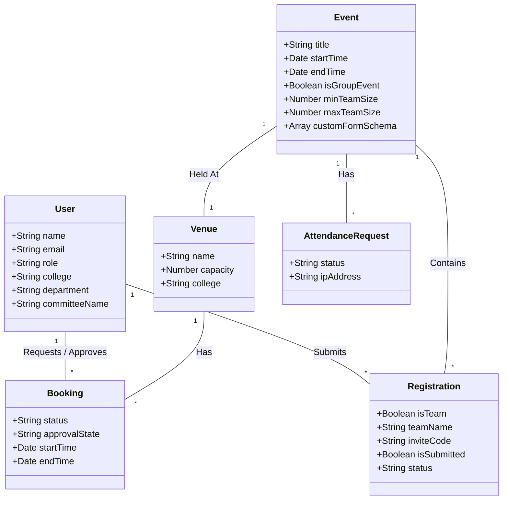
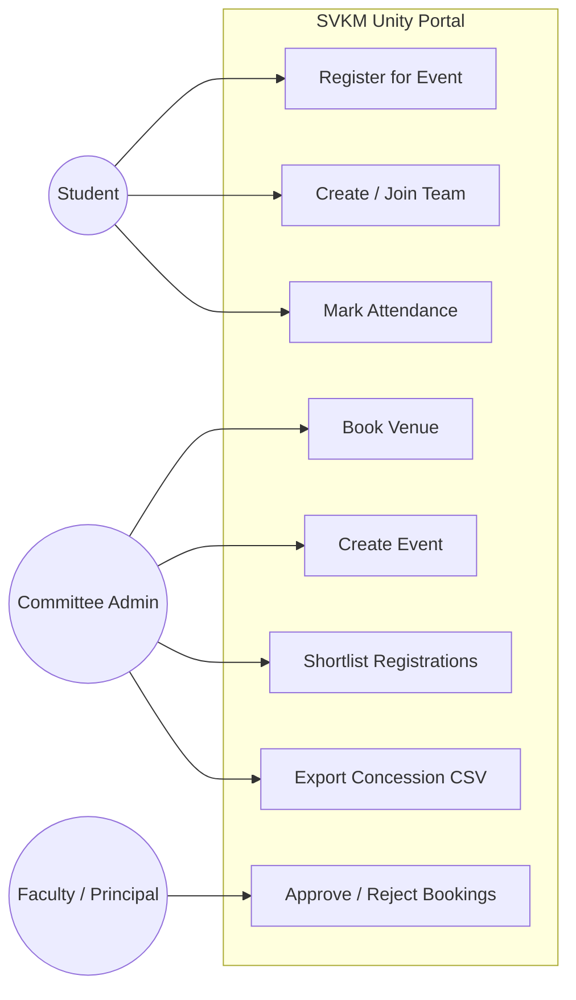
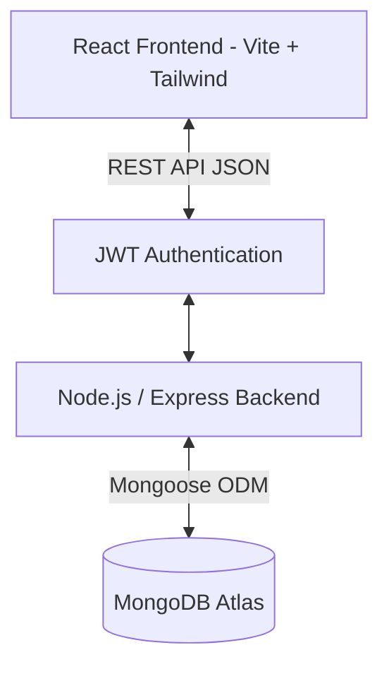

# SVKM Unity – Event Management System Project Report

## 1. Title
**SVKM Unity – Comprehensive Event, Resource, and Institutional Governance Portal**

## 2. Existing System and Problem
Currently, the event management ecosystem within the university is highly fragmented. Workflows rely heavily on long email chains, physical files for approvals, and disparate Google Forms for student registrations. 
This disconnected system leads to multiple problems:
* **Venue Conflicts:** Two committees often double-book the same venue due to a lack of a centralized tracking calendar.
* **Lost Paperwork:** Physical permission files get delayed or lost moving between Faculty, HODs, and Principals.
* **Registration Chaos:** Managing team-based events via Google Forms requires manual matching of members, leading to missing data and incomplete teams.
* **Proxy Attendance:** Students often mark proxies for attendance, and compiling a final "Attendance Concession" (On-Duty) list is a tedious manual task.

## 3. Need for the Proposed System
To solve these inefficiencies, the university needs a **Centralized Software-as-a-Service (SaaS) Platform** that digitizes the entire lifecycle of a university event. A unified portal ensures transparency, enforces hard rules (like preventing double-bookings programmatically), eliminates paper waste, and provides a seamless, modern experience for the student body.

## 4. Objectives of the Project
* **Eliminate Venue Conflicts:** Implement a smart booking engine with soft-locks to guarantee zero double-bookings.
* **Paperless Approvals:** Create a digital state-machine workflow for faculty and principal approvals.
* **Streamlined Registration:** Provide a "Devfolio-style" team registration system ensuring teams meet minimum size requirements before submission.
* **Robust Attendance:** Replace physical sign-in sheets with a secure, rate-limited digital punch-in system, culminating in a one-click CSV export for official OD concessions.

## 5. Scope of the Project
The current scope encompasses four primary user roles:
1. **Students:** Can discover events, register (solo or as a team), submit custom individual forms, and mark their attendance.
2. **Committee Admins:** Can book venues, create events, define shortlisting logic, and manage attendance sessions.
3. **Faculty Mentors:** Can review and approve/reject provisional venue bookings initiated by their committees.
4. **Principals/College Admins:** Have the final authority to approve venue bookings to lock them officially.

## 6. Functional & Non-Functional Requirements

### Functional Requirements
* **Smart Booking:** The system shall soft-lock a venue upon request and prevent concurrent bookings.
* **Hierarchical Approval:** Bookings must transition through `provisional -> pending_faculty -> pending_principal -> approved`.
* **Team Registration:** The system shall validate unique team names, enforce `minTeamSize` and `maxTeamSize`, and collect custom form answers per member.
* **Attendance System:** The system shall generate a secure session code, accept student punch-ins, allow admin bulk-approval, and export a final CSV.

### Non-Functional Requirements
* **Security:** Passwords hashed with Bcrypt, API routes secured with JWT, and role-based access control (RBAC).
* **Reliability:** The system uses MongoDB transactions to prevent race conditions during venue booking and team joining.
* **Usability:** A responsive, modern UI built with React and Tailwind CSS.
* **Performance:** IP-based rate limiting on the attendance endpoint to prevent spam.

## 7. System Design

### Class Diagram / Data Model

### Use Case Diagram

## 8. Architecture
The system follows a standard modern **MERN Stack** Client-Server Architecture.

## 9. Screenshots of Working System
*(Note: Please insert real screenshots here prior to final submission)*
1. **Login Page:** showing role-based entry.
2. **Committee Admin Dashboard:** Showing the Venue Booking and Event Creation forms.
3. **Approver Dashboard:** Showing a pending venue request waiting for Faculty approval.
4. **Student Dashboard:** Showing the Devfolio-style Team interface (Members list, Incomplete status).
5. **Admin Shortlisting Sheet:** Showing the dynamic data table with individual form answers.
6. **Attendance Export:** Showing the bulk-approval interface.

## 10. Test Cases Report

| Test Case ID | Description | Expected Result | Actual Result | Status |
|---|---|---|---|---|
| TC_01 | Attempt to book an already locked venue for the same time. | System throws 409 Conflict Error. | Throws 409 Error. | PASS |
| TC_02 | Student attempts to submit a team with 1 member when min is 2. | Submit button is disabled/Backend rejects. | Button disabled & backend rejects. | PASS |
| TC_03 | Student attempts to join a team using an invalid code. | System throws 404/400 Invalid Code. | Throws Invalid Code. | PASS |
| TC_04 | Faculty Mentor approves a booking. | State changes to `pending_home_principal`. | State updates correctly. | PASS |
| TC_05 | Admin generates Attendance session, Student enters incorrect code. | System rejects attendance request. | Rejects with "Invalid Code". | PASS |
| TC_06 | Admin exports attendance CSV for an event. | CSV downloads containing only `approved` students. | CSV generated successfully. | PASS |
